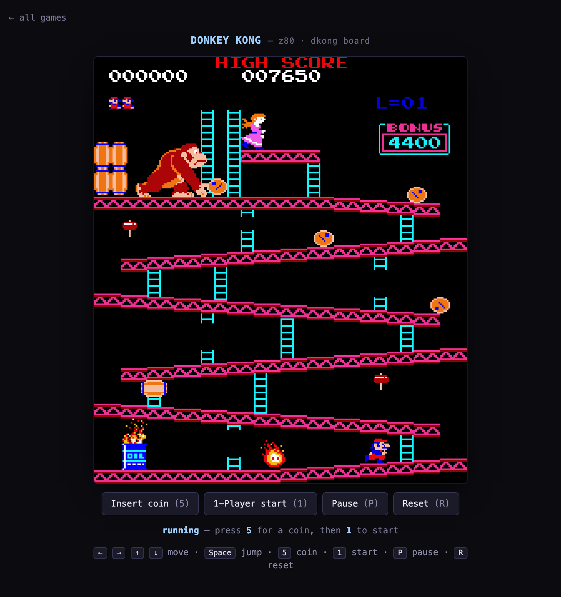
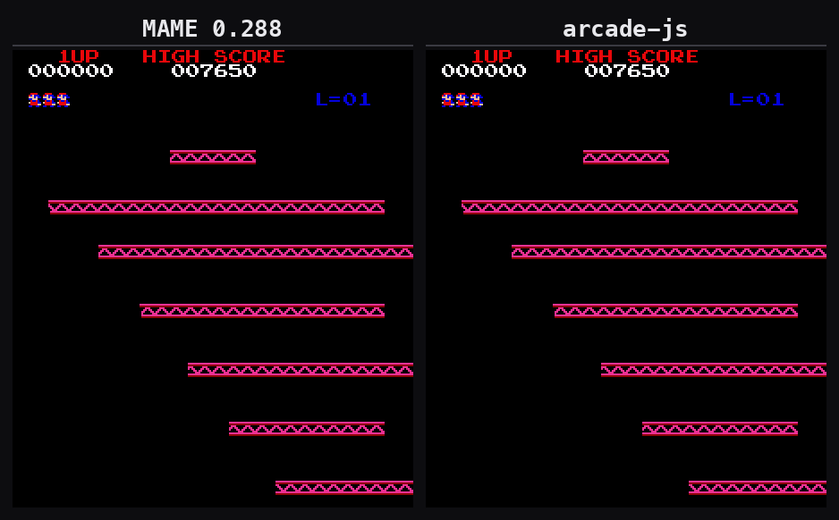

# arcade-js

**An experiment in using AI agents to port existing software.** The disassembly, the
translation, the tests and the tooling in this repo were produced by agents. Arcade ROMs are
the testbed, chosen for one reason: **you can prove whether the port is correct.**

Most porting work has no oracle. You rewrite something, it looks right, and "faithful" stays
a matter of opinion. An arcade ROM doesn't have that problem — MAME already runs it, so there
is a reference implementation emitting exact expected output. Correctness becomes falsifiable
and frame-by-frame: did our JavaScript produce the same pixels as the original machine code,
or did it not?

Concretely, then: arcade games **translated from their original machine code to JavaScript**,
validated **pixel-exact against MAME**. Not a re-implementation from observation — the ROM is
disassembled and translated instruction by instruction, then checked frame against frame until
the pixels match.

**Donkey Kong** is the first subject. The repo is structured to host many: multiple CPUs,
multiple arcade boards, and multiple game romsets, sharing what they genuinely share.

How the agents were organised — the division of labour, the failure modes we actually hit, and
what the tooling had to do about them — is written up in
[docs/00-how-the-agents-worked.md](docs/00-how-the-agents-worked.md).



> **Status:** Donkey Kong plays. All four boards, natural board-to-board progression, and the
> level loop all work — finish 100m and it wraps back to 25m at the next level, indefinitely —
> and the rendering is pixel-validated frame-by-frame against MAME 0.288.
> **Not yet done:** sound. The audio layer is a seam, not an implementation.

## What's here (and what isn't)

This repo ships our **tools** and our **translation** (the JavaScript — our own expression of
the ROM's logic). It does **not** ship the copyrighted ROM data, and it does not ship analysis
metadata either — `dk.asm`, `coverage.json`, `blocks.def`, `unreached.txt` under
`games/dkong/out/` are gitignored build output; regenerate them locally with `make trace`. You
supply your own ROM; `make rom-dkong` assembles and **sha256-verifies** it locally. See
[`games/dkong/rom/README.md`](games/dkong/rom/README.md).

### You still need the ROM — here's why

The translation replaces the ROM's **logic**, not its **contents**. A ROM is not only code:

- **Graphics and palette are pure data.** `gfx1` (8×8 tiles), `gfx2` (16×16 sprites) and the
  colour `proms` have no code in them at all. Without them there is nothing to draw.
- **The code reads the ROM as data.** Donkey Kong's first game-state handler runs
  `ld hl,0x01ba` / `ldir`, copying a table straight out of ROM. So the engine still maps the
  ROM into the address space and reads from it — our JavaScript is what *executes*, the ROM
  is still what it *reads*.

Which is exactly why the copyright line falls where it does: the JavaScript is our own
expression of the logic and it ships; the original data is Nintendo's and it never does.

## How we know it's right

If the question is whether agents can port software faithfully, the answer is only worth as
much as what could have proven it wrong. These gates are the experiment's instrumentation,
and every one of them runs from a clean checkout:



*Donkey Kong's game-start intro: MAME on the left, arcade-js on the right, driven by the same
input tape and aligned with the pixel gate's own frame offset. Both panels are rendered from
the very `frames.rgb` artifacts the gate diffs — not a screen recording of two windows. Shown
at 2× speed; over this 35-second run the largest single-frame difference is 0.17%.*

- **Pixel gate.** Capture a golden from **live MAME 0.288** under a pinned, determinism-
  controlled command line, run the same input tape through our engine, and diff the frames.
  Movement 6/6 and bonus-item 9/9 scenarios pass across all four board types. Those scenarios
  poke the board state to start on a given board, which keeps each one short and deterministic
  — that's a property of the fixtures, not a limit of the game, which progresses on its own.
- **Decoder cross-check.** Our Z80 decoder is checked against `z80dasm` over the whole ROM:
  6051 instruction boundaries, zero disagreements in either direction (`make verify`).
- **Step audit.** Every `m.step()` target in the translation is verified to land on a real
  instruction boundary (`make stepcheck`). The static tracer reaches ~77% of the ROM; targets
  in the spans it hasn't reached are reported as **coverage gaps rather than quietly counted
  as passes** — a green gate says what it actually covered.
- **343 unit tests**, with mutation patches recorded next to the assertions they justify, so
  a test that cannot fail is visible as such.
- **State and write diffs.** RAM and the hardware write surface are diffed independently of
  pixels, which separates "the CPU translation is wrong" from "the video model is wrong."

## Layout

```
core/                 game-agnostic engine
  cpu/z80.js          the Z80 processor        (any Z80 game reuses this)
  cpu/test/           unit tests for the CPU core
  audio.js            sample-player abstraction (audio lives ABOVE emulation)
boards/               arcade hardware, named by MAME driver (a "board")
  dkong/              memory map · i8257/watchdog/latches · video/palette/geometry
  dkong/hardware.json the same, as JSON: the single source the shared Python gate
                      tools read via --hardware, instead of hardcoding DK addresses
  dkong/test/         unit tests for the board
games/                one directory per romset
  dkong/
    manifest.js       declares its cpu + board + rom set + inputs + metadata
    translated/       the assembly-JS translation of the ROM
    optimized/        (room for) idiomatic-JS rewrites, gated for equivalence
    audio/            sound-command → sample trigger map
    rom/              gitignored — `make rom-dkong` builds it locally
    tapes/            test input tapes (published)
    test/             unit + integration tests for the translation
    entrypoints.json  disassembly entry points (folded into the trace)
    tools/            per-game gate runners (emit.js · move_suite.py · prize_suite.py)
web/                  browser front-end: pick a game and play it
tools/                disassembler · tracer · MAME golden capture · pixel/state diff ·
                       gate runner (verdict.sh) — shared, game-agnostic
docs/                 how it's done: disassembly → translation → testing → the pixel gate
```

Tests are colocated with the code they test (`core/**/test/`, `boards/**/test/`,
`games/**/test/` — see `npm test`'s glob), not in a separate top-level `test/`.

The three layers — **CPU**, **board**, **game** — are independent axes. A game's
`manifest.js` names its CPU (`z80`) and board (`dkong`); the machine assembles
CPU + board + translated ROM. Frogger, for example, would reuse `core/cpu/z80.js` on a
future `boards/galaxian/`. The manifest also declares an `inputs` block (ports, actions,
key bindings) that `web/` reads to build its keyboard map — see doc 6 — so a manifest
without it can't be played in the browser.

## Quickstart

Bring your own `dkong.zip` and you'll be playing in about a minute:

```sh
make rom-dkong     # assemble your ROM locally (sha256-checked)
make serve         # dev server (sets COOP/COEP), then open the printed URL
```

Pick Donkey Kong, press **5** to drop a coin and **1** to start — arrows or WASD to move,
space to jump.

```sh
npm test           # 343 unit tests (ROM-dependent ones skip cleanly if you haven't built one)
```

(`make rom-dkong` is an alias for `make -C games/dkong rom`; `make serve` is an alias for
`npm run serve` — either form works, pick one.)

Requirements: Node, Python 3 (+ numpy, Pillow for the pixel gate), z80dasm (cross-checks the
decoder for `make verify`), and — for regenerating MAME goldens — MAME 0.288 and ffmpeg.

## Adding a game

See [`docs/`](docs/) for the full methodology and the "add a game" guide. In short: pick
(or write) the CPU and board, disassemble and translate the ROM into `games/<name>/`, and
drive it under the pixel gate until it matches MAME.

## License

[GPLv3](LICENSE). The translation and tools are ours and free software; the original ROM
data is not included and is not ours.
